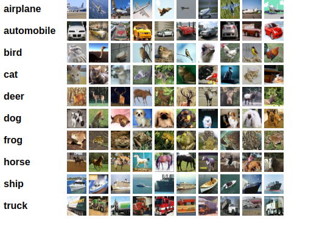

# ACML-CNN-GROUP
Adaptive Computation and Machine Learning Project

## Cross-Validation with CNN on CIFAR-10 Dataset

This code performs k-fold cross-validation using a Convolutional Neural Network (CNN) on the CIFAR-10 dataset. Here's an overview of the main components and their purpose:

- **Data Preprocessing**:
  - The CIFAR-10 dataset is loaded using Keras.
  - The images are normalized by dividing pixel values by 255 to scale them between 0 and 1.
  - The labels are one-hot encoded to represent the classes.
  
- **CNN Model Architecture**:
  - The `build_model` function constructs a CNN with a specified number of layers.
  - Each layer consists of convolutional operations followed by activation functions.
  - Max pooling is applied to downsample the feature maps.
  - The flattened features are connected to dense layers with a softmax activation for classification.
---
## Why Convolutional Neural Network (CNN)?

A Convolutional Neural Network (CNN) is used in this code for image classification tasks such as the CIFAR-10 dataset. Here's why CNNs are particularly well-suited for such tasks:

- **Spatial Hierarchical Feature Learning**: CNNs are designed to automatically learn hierarchical representations of visual data. They excel at capturing spatial patterns and local dependencies within images. This makes them highly effective for tasks like image classification, where understanding local patterns is crucial.

- **Convolutional Layers**: CNNs utilize convolutional layers, which consist of learnable filters that scan the input image. These filters capture local features such as edges, textures, and shapes, regardless of their precise location. Convolutional layers are able to extract useful features from images in a translation-invariant manner.

- **Pooling Layers**: Pooling layers are used in CNNs to downsample the feature maps obtained from the convolutional layers. They summarize the information in a neighborhood, reducing the spatial dimensions while preserving the most important features. Pooling helps in capturing spatial invariance and reducing the computational burden.

- **Translation Invariance**: CNNs are invariant to translations in the input space, which means they can recognize patterns regardless of their exact position in an image. This property makes CNNs robust to small variations in object location, enabling them to generalize well to different images.

- **Parameter Sharing**: CNNs utilize parameter sharing, where the same set of weights is applied to different parts of the input image. This reduces the number of parameters compared to fully connected networks, making CNNs more efficient and scalable for image data.

- **Highly Scalable**: CNNs can be scaled up to handle large and complex datasets. Deeper CNN architectures with multiple convolutional layers have been shown to capture more abstract and intricate image features, leading to improved performance.

In summary, CNNs leverage their ability to learn spatial hierarchical representations and capture local dependencies to excel at image classification tasks. They are capable of automatically extracting meaningful features from images and generalizing well to unseen data.

- **K-Fold Cross-Validation**:
  - The dataset is split into `k` folds using `KFold` from scikit-learn.
  - For each fold, a new run is initialized using `wandb.init()` to track the experiments.
  - The CNN model is built and compiled.
  - The model is trained on the training set and validated on the validation set.
  - Early stopping is used to prevent overfitting.
  - Model summary, accuracy vs. epoch, and loss vs. epoch are logged using `wandb.log()`.

## Why K-Fold Cross-Validation?

K-Fold Cross-Validation is used in this code for the following reasons:

- **Limited Dataset**: The CIFAR-10 dataset has a limited number of samples. K-Fold Cross-Validation allows us to make efficient use of the available data by splitting it into multiple folds and evaluating the model on each fold.

- **Generalization Performance**: By rotating the folds as the validation set, we obtain a more reliable estimate of the model's performance on unseen data. It helps us assess how well the model will generalize to new, unseen images.

- **Reducing Overfitting**: Since the model is evaluated on multiple validation sets, it helps in reducing the risk of overfitting. Overfitting occurs when the model performs well on the training data but fails to generalize to new data. K-Fold Cross-Validation provides a more accurate assessment of the model's performance on unseen data.

---

## Varying Number of Layers and Learning Rates

In this code, we experiment with different numbers of layers and learning rates for the CNN model. This is done to explore how these hyperparameters affect the model's performance on the CIFAR-10 dataset.

- **Number of Layers**: The number of layers in a CNN can impact its capacity to learn complex patterns in the data. By varying the number of layers, we can observe the effect on the model's ability to extract meaningful features and its overall performance.

- **Learning Rates**: The learning rate determines the step size at which the model's parameters are updated during training. It plays a crucial role in finding the optimal balance between converging to the optimal solution and avoiding overshooting. By trying different learning rates, we can find the value that yields the best convergence and performance.

By systematically varying the number of layers and learning rates, we can identify the optimal configuration that maximizes the model's performance on the CIFAR-10 dataset.

- **Evaluation and Analysis**:
  - After training on all folds, the final model is saved.
  - The model is evaluated on the test set using accuracy, F1 score, and precision.
  - A confusion matrix is generated to visualize the performance across classes.
  - A precision-recall curve is plotted to examine the precision and recall trade-off.
  - Example images from the test set along with their predictions are logged.

### Conclusion

By using k-fold cross-validation, different folds of the dataset are used for training and validation in each iteration. This helps in obtaining a more robust evaluation of the model's performance and reduces the risk of overfitting or biased results.

The number of layers and learning rate are hyperparameters that can significantly impact the CNN's performance. By experimenting with different numbers of layers and learning rates, this code allows for an exploration of various model architectures and optimization strategies. This helps in finding the optimal combination that yields the best accuracy, precision, and F1 score on the CIFAR-10 dataset.

### Confusion Matrix

### Example Images

